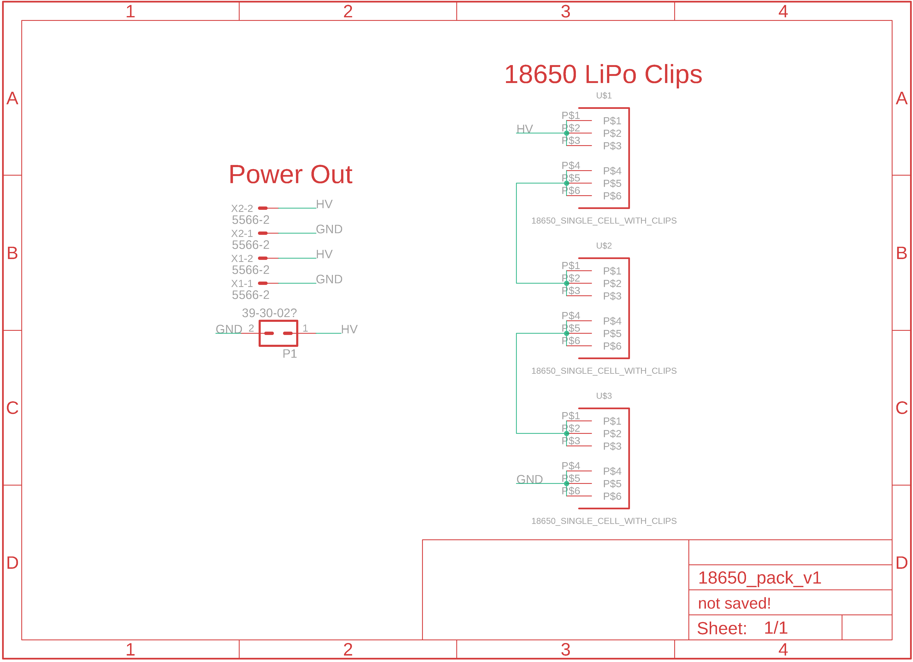
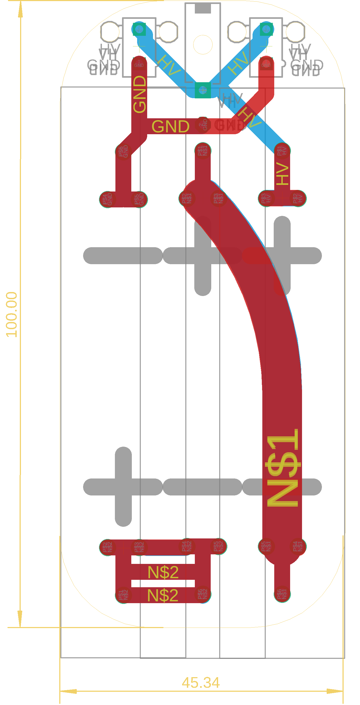

## 18500 Pack V2 Notes
This pack is specifically designed to be placed within a 60mm wide enclosure. 

Please keep in mind the expected current requirements for your device
when choosing the copper weight during the manufacturing process. Likewise,
keep in mind the values and current requirements for your physical user
controls (if attached through the PCB).
- The PWR traces for the board are 100 mil thick 
- This means that if the copper thickness is 1 oz. the board can withstand continuous currents of around 4.7 Amps 
- If the copper thickness is increased to 2 oz the board can withstand around 7.7 amps 
- Both of these numbers are very rough estimates that are assuming an ambient temperature of 25 C, and a maximum trace temperature ride of 10 C
- The PCB Trace Width Calculator by 4pcb.com is a great tool to help with these calculators: [Try Their Tool Here!]<https://www.4pcb.com/trace-width-calculator.html>

**PLEASE NOTE**: The 18500 battery pack actually supports more current than this pack, is smaller, and supports the routing of user control connections through the battery pack to reducing enclosure wiring. HOWEVER, the 18500 pack has traces EXTEMELY close to the edge and must be used with caution.

## Schematic

## Layout

### Notes for Future Revisions
- The PCB size can be reduced
- The Trace widths for most connections can be increased.
- Second iteration that accomidates user control connections can be considered (similar to the 18500 PCB)
