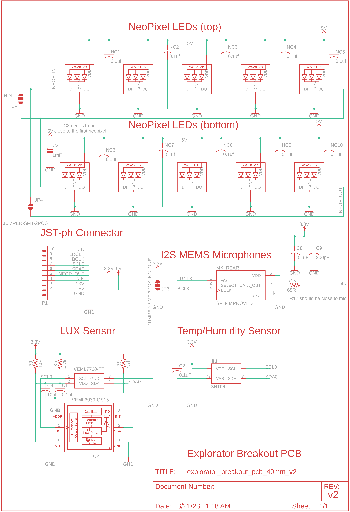
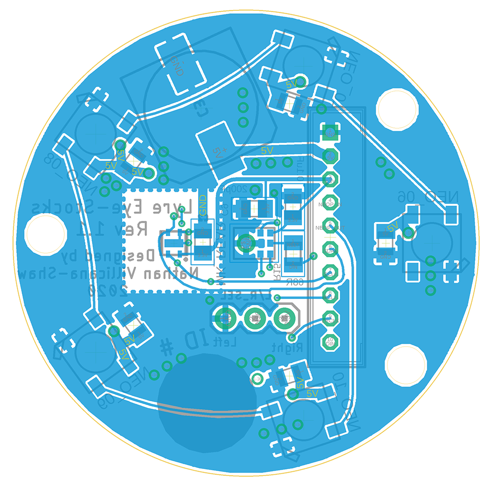
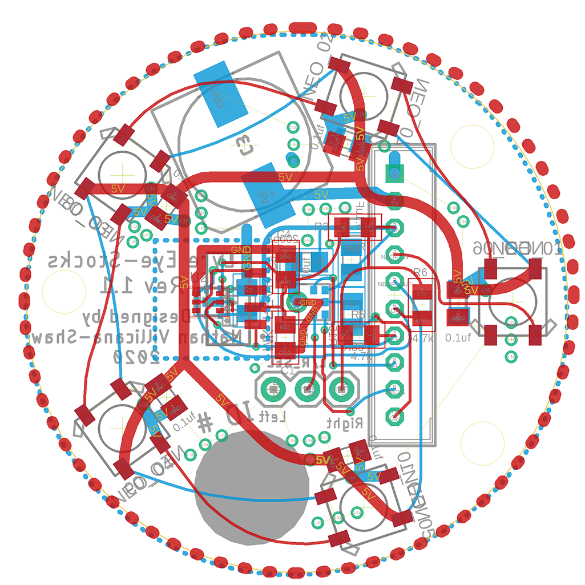
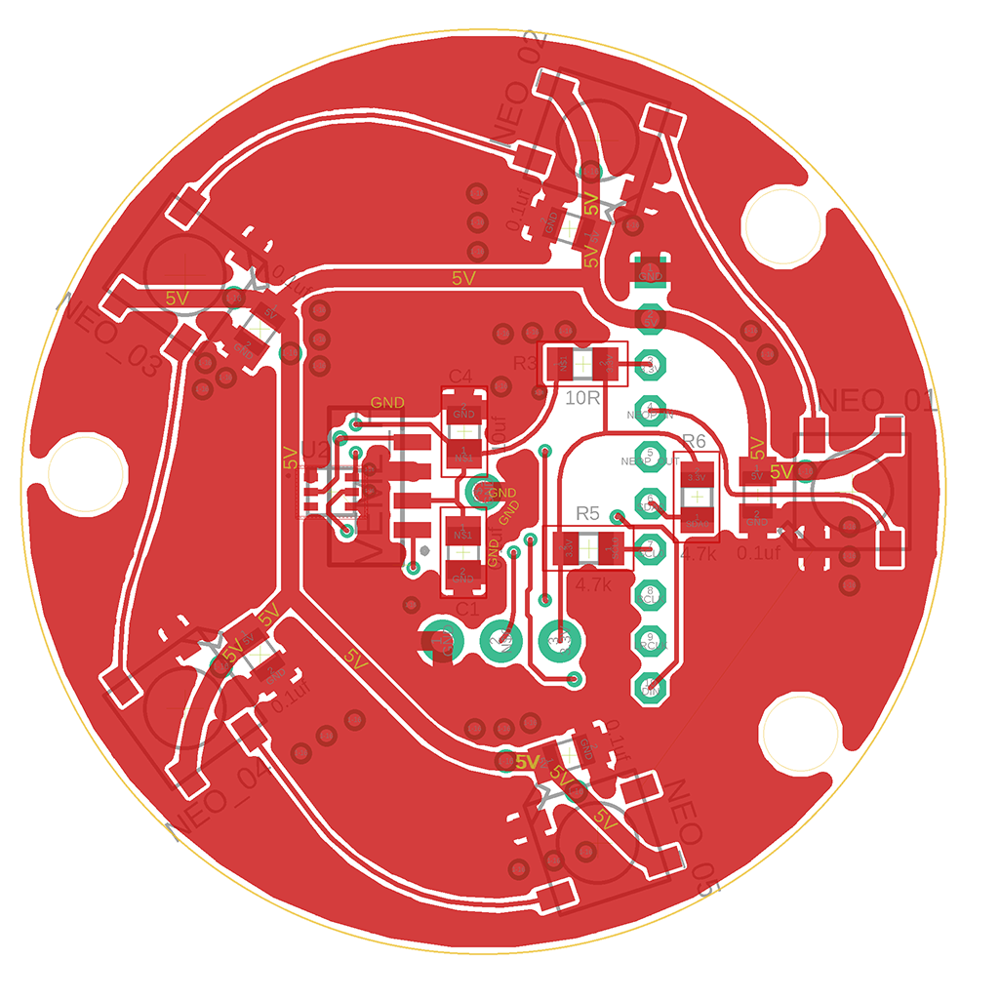

## Explorator Breakout PCB
This PCB can be used in tandem with the Explorator mainboard PCBs
To provide environmental sensing capability.

### Notes
- The PCB provides footprints for two different types of ambient light sensors to allow the user to select whichever sensor they have in stock or is best suited for the project. The foootprints provided are for the 
  - VEML6030 sensor 
  - VEML7700 sensor

## Schematic

## Layout
  

### Notes for Future Revisions
- The PCB size can be reduced
- The Trace widths for most connections can be increased.
- Second iteration that accomidates user control connections can be considered (similar to the 18500 PCB)